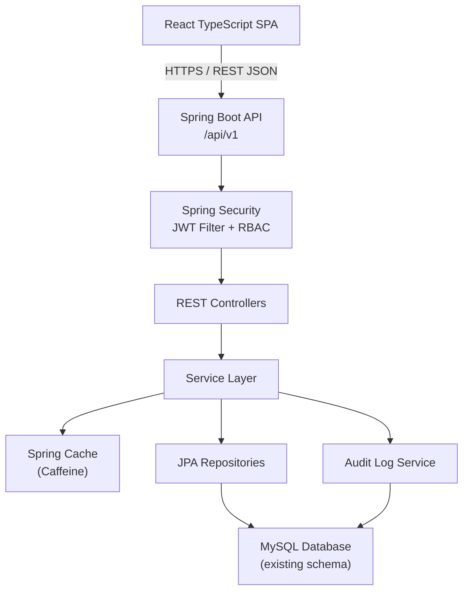
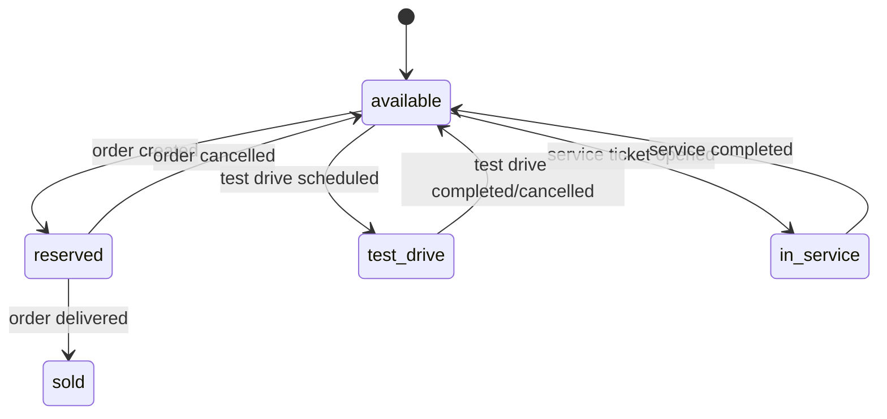
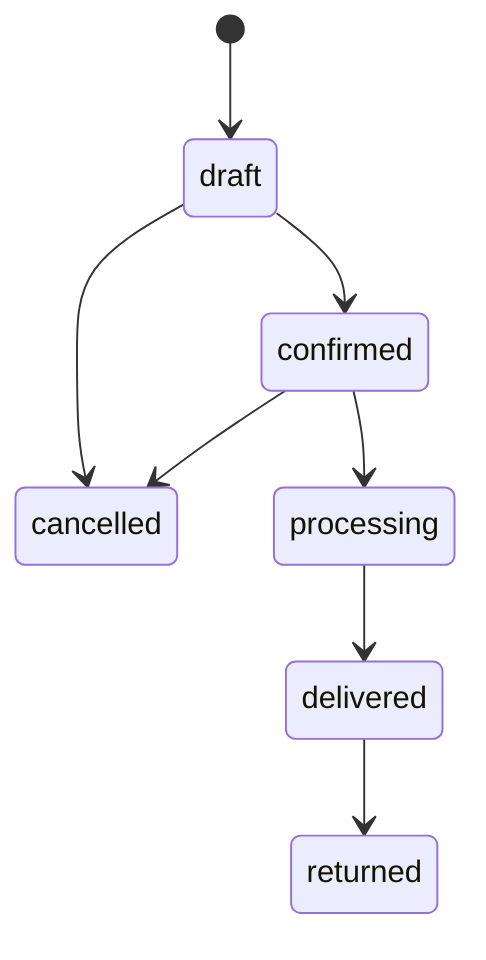
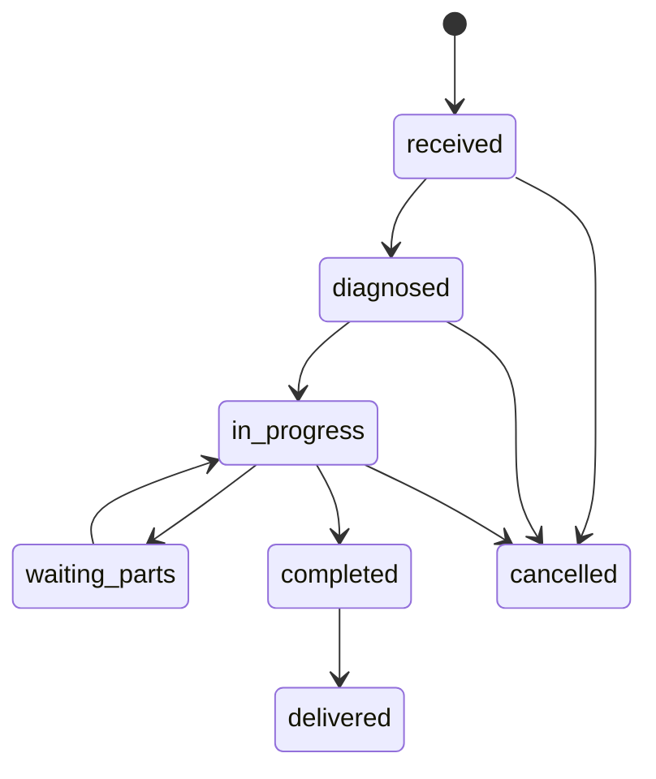

# Design Document — Hyundai Dealer Management System (DMS)

## Overview

The Hyundai DMS is a full-stack web application that enables dealership staff to manage vehicle inventory, customers, sales orders, service tickets, test drives, and payments through a role-based, secure interface.

The backend is a Spring Boot 3.5 (Java 21) REST API exposing JSON endpoints under `/api/v1`. The frontend is a React TypeScript SPA. Authentication is stateless JWT (access token 15 min, refresh token 7 days with rotation). All data is persisted in MySQL using an existing, immutable schema.

Key design goals:
- Strict RBAC enforced at the Spring Security filter layer
- Dealership-scoped data isolation for all non-super_admin roles
- Immutable audit trail for every significant action
- Cache-aside pattern (Caffeine) for high-read endpoints
- Consistent structured error responses across all endpoints

---

## Architecture



### Layer Responsibilities

- **Controllers** — parse/validate HTTP requests, delegate to services, return DTOs
- **Services** — business logic, dealership scoping, cache interaction, audit event emission
- **Repositories** — Spring Data JPA interfaces; no raw SQL except for complex queries via `@Query`
- **Security** — `JwtAuthenticationFilter` extracts and validates the JWT on every request; `@PreAuthorize` / `SecurityConfig` enforces role rules
- **AuditService** — a single shared service called by all other services to write `audit_logs` rows; never called from controllers directly

### Package Structure

```
com.hyundai.dms
├── config/          # SecurityConfig, CacheConfig, LoggingConfig, JwtConfig
├── controller/      # One controller per domain (Auth, Dealership, User, Customer, ...)
├── service/         # One service per domain + AuditService + NotificationService
├── repository/      # Spring Data JPA repositories
├── entity/          # JPA @Entity classes (one per table)
├── dto/             # Request/Response DTOs (records or Lombok @Data)
├── security/        # JwtUtil, JwtAuthenticationFilter, UserDetailsServiceImpl
├── exception/       # GlobalExceptionHandler, custom exception classes
└── util/            # PaginationUtil, OrderNumberGenerator, TicketNumberGenerator
```

---

## Components and Interfaces

### Security Components

**JwtUtil**
- `generateAccessToken(UserDetails user, long dealershipId)` → signed JWT, 15-min expiry, claims: `sub`, `role`, `dealership_id`, `iat`, `exp`
- `generateRefreshToken()` → `SecureRandom` 64-byte hex string (raw); caller stores SHA-256 hash
- `validateToken(String token)` → throws `JwtException` subtypes on failure
- `extractClaims(String token)` → `Claims`

**JwtAuthenticationFilter** (`OncePerRequestFilter`)
- Reads `Authorization: Bearer <token>` header
- Calls `JwtUtil.validateToken`; on failure logs WARN and sets no authentication (Spring Security returns 401)
- On success sets `UsernamePasswordAuthenticationToken` in `SecurityContextHolder` with a custom `AuthenticatedUser` principal carrying `userId`, `role`, `dealershipId`

**SecurityConfig** (`@Configuration`)
- Permits `POST /api/v1/auth/login` and `POST /api/v1/auth/refresh` without authentication
- All other paths require authentication
- Role-level rules expressed via `@PreAuthorize` on service methods (not in SecurityConfig) for fine-grained control

### REST Controllers

| Controller | Base Path | Key Endpoints |
|---|---|---|
| `AuthController` | `/api/v1/auth` | POST login, POST refresh, POST logout |
| `DealershipController` | `/api/v1/dealerships` | GET list, GET by id, POST, PUT, DELETE |
| `UserController` | `/api/v1/users` | GET list, POST, PUT, PATCH status, DELETE, PATCH password |
| `CustomerController` | `/api/v1/customers` | GET list, POST, PUT, PATCH status, DELETE |
| `InventoryController` | `/api/v1/inventory` | GET list, GET by id, POST, PUT, PATCH status |
| `TestDriveController` | `/api/v1/test-drives` | GET list, POST, PATCH status, PUT |
| `OrderController` | `/api/v1/orders` | GET list, POST, PUT, PATCH status |
| `PaymentController` | `/api/v1/payments` | GET list, POST, PATCH status |
| `ServiceTicketController` | `/api/v1/service-tickets` | GET list, POST, PUT, PATCH status, POST items |
| `AuditLogController` | `/api/v1/audit-logs` | GET list |
| `NotificationController` | `/api/v1/notifications` | GET list, PATCH read, PATCH read-all |
| `AdminController` | `/api/v1/admin` | GET cache/stats |

### Service Interfaces (key methods)

**AuthService**
- `login(LoginRequest)` → `TokenResponse`
- `refresh(String rawRefreshToken)` → `TokenResponse`
- `logout(AuthenticatedUser)` → void

**DealershipService**
- `findAll(Pageable)` → `Page<DealershipResponse>` (cached)
- `findById(Long id)` → `DealershipResponse` (cached)
- `create(DealershipRequest)` → `DealershipResponse` (evicts cache)
- `update(Long id, DealershipRequest)` → `DealershipResponse` (evicts cache)
- `softDelete(Long id)` → void (evicts cache)

**InventoryService**
- `findAll(InventoryFilter, Pageable, AuthenticatedUser)` → `Page<InventoryResponse>` (cached)
- `changeStatus(Long id, InventoryStatus newStatus, AuthenticatedUser)` → void (writes `inventory_history`, evicts cache)

**OrderService**
- `create(CreateOrderRequest, AuthenticatedUser)` → `OrderResponse` (verifies vehicle available, sets reserved)
- `changeStatus(Long id, OrderStatus newStatus, AuthenticatedUser)` → void (handles vehicle status side-effects)
- `computeTotals(List<OrderItem>, BigDecimal taxRate)` → `OrderTotals` (server-side only)

**AuditService**
- `log(AuditEvent event)` → void (fire-and-forget, async `@Async`)

**NotificationService**
- `createForUser(Long userId, String type, String title, String body, String refType, Long refId)` → void

### Global Exception Handler

`@RestControllerAdvice GlobalExceptionHandler` maps:

| Exception | HTTP Status |
|---|---|
| `ResourceNotFoundException` | 404 |
| `AccessDeniedException` | 403 |
| `MethodArgumentNotValidException` | 400 with `fieldErrors` map |
| `ConstraintViolationException` | 400 |
| `JwtException` subtypes | 401 |
| `AccountLockedException` | 423 |
| `OrderAlreadyPaidException` | 400 |
| `Exception` (catch-all) | 500 |

All responses share the envelope:
```json
{
  "timestamp": "2025-01-01T10:00:00Z",
  "status": 400,
  "error": "Bad Request",
  "message": "Validation failed",
  "fieldErrors": { "email": "must be a valid email" }
}
```

### Pagination Envelope

All paginated list endpoints return:
```json
{
  "content": [...],
  "totalElements": 150,
  "totalPages": 8,
  "page": 0,
  "size": 20
}
```

Query parameters: `page` (0-based, default 0), `size` (default 20, max 100), `sort` (field name), `direction` (`asc`/`desc`).

---

## Data Models

The database schema is fixed. The following describes the JPA entity mappings and key DTO shapes.

### JPA Entities (one per table)

```
Dealership        → dealerships
User              → users (self-ref manager_id)
RefreshToken      → refresh_tokens
Customer          → customers
Inventory         → inventory
TestDrive         → test_drives
Order             → orders
OrderItem         → order_items
Payment           → payments
ServiceTicket     → service_tickets
ServiceItem       → service_items
AuditLog          → audit_logs
InventoryHistory  → inventory_history
Notification      → notifications
```

All entities use `@Entity`, `@Table`, Lombok `@Getter @Setter`, and `@NoArgsConstructor`. Enum columns use `@Enumerated(EnumType.STRING)`. JSON columns (`photos`, `features`, `old_values`, `new_values`) are mapped as `String` with `@Column(columnDefinition = "json")`.

### Key DTO Shapes

**LoginRequest**
```json
{ "email": "staff@dealer.com", "password": "secret" }
```

**TokenResponse**
```json
{ "accessToken": "eyJ...", "refreshToken": "abc123...", "expiresIn": 900 }
```

**CreateOrderRequest**
```json
{
  "customerId": 1,
  "items": [
    { "inventoryId": 5, "itemType": "vehicle", "description": "Hyundai Creta", "unitPrice": 1500000, "quantity": 1, "discount": 0 }
  ],
  "discountAmount": 0,
  "taxRate": 18.00,
  "notes": ""
}
```

**OrderResponse** — includes computed `subtotal`, `taxAmount`, `totalAmount`; never accepts these from client.

**PaginatedResponse\<T\>**
```java
public record PaginatedResponse<T>(
    List<T> content,
    long totalElements,
    int totalPages,
    int page,
    int size
) {}
```

### Inventory Status State Machine



### Order Status State Machine



### Service Ticket Status State Machine



### Caching Strategy

| Cache Name | Cached Data | TTL | Eviction Trigger |
|---|---|---|---|
| `dealerships` | `GET /dealerships` list | 10 min | create / update / delete dealership |
| `dealership` | `GET /dealerships/{id}` | 10 min | update / delete that dealership |
| `inventory` | `GET /inventory` list | 5 min | create / update / status change inventory |

Spring Cache annotations: `@Cacheable`, `@CacheEvict(allEntries=true)` on mutating service methods.


---

## Correctness Properties

*A property is a characteristic or behavior that should hold true across all valid executions of a system — essentially, a formal statement about what the system should do. Properties serve as the bridge between human-readable specifications and machine-verifiable correctness guarantees.*

### Property 1: Active-only token issuance

*For any* user whose `status` is `inactive` or `suspended`, a login attempt SHALL return HTTP 403 and no tokens shall be issued.

**Validates: Requirements 2.2**

### Property 2: Locked account rejection

*For any* user whose `locked_until` timestamp is in the future, a login attempt SHALL return HTTP 423 regardless of password correctness.

**Validates: Requirements 2.3**

### Property 3: Failed login counter increment

*For any* user, each login attempt with an incorrect password SHALL increment `failed_login_attempts` by exactly 1 and produce a `LOGIN_FAILED` audit log entry.

**Validates: Requirements 2.4**

### Property 4: Successful login resets state

*For any* user with valid credentials, a successful login SHALL reset `failed_login_attempts` to 0, update `last_login`, and produce a `LOGIN` audit log entry.

**Validates: Requirements 2.6**

### Property 5: Refresh token stored as hash

*For any* issued refresh token, the value stored in `refresh_tokens.token_hash` SHALL equal `HEX(SHA-256(rawToken))` and the raw token SHALL never appear in the database.

**Validates: Requirements 2.7**

### Property 6: Access token claims completeness

*For any* issued access token, decoding the JWT payload SHALL yield all five required claims: `sub`, `role`, `dealership_id`, `iat`, and `exp`.

**Validates: Requirements 2.8**

### Property 7: Refresh token rotation

*For any* valid, non-expired, non-revoked refresh token, calling the refresh endpoint SHALL atomically revoke the old token (`is_revoked=1`) and issue a new access token and a new refresh token; the old token SHALL be rejected on any subsequent refresh attempt.

**Validates: Requirements 3.1, 3.2**

### Property 8: Logout revokes all tokens

*For any* authenticated user, calling logout SHALL set `is_revoked=1` on every active refresh token for that user, and produce a `LOGOUT` audit log entry; subsequent refresh attempts with any of those tokens SHALL return HTTP 401.

**Validates: Requirements 3.3**

### Property 9: Refresh token metadata captured

*For any* row inserted into `refresh_tokens`, both `ip_address` and `user_agent` SHALL be non-null.

**Validates: Requirements 3.4**

### Property 10: Role-based access enforcement

*For any* authenticated user with role R and any endpoint E that R is not permitted to access, the API SHALL return HTTP 403 without executing the business logic.

**Validates: Requirements 4.2, 4.3, 5.4**

### Property 11: Dealership data scoping

*For any* authenticated user whose role is not `super_admin`, every list or detail endpoint SHALL return only records whose `dealership_id` matches the user's `dealership_id`; records from other dealerships SHALL never appear in the response.

**Validates: Requirements 4.4, 16.4**

### Property 12: Structured error envelope

*For any* request that results in an error (4xx or 5xx), the response body SHALL be a JSON object containing at minimum the fields `timestamp`, `status`, `error`, and `message`.

**Validates: Requirements 5.1**

### Property 13: Validation errors include field details

*For any* request body that fails Bean Validation, the API SHALL return HTTP 400 with a `fieldErrors` map where each key is the invalid field name and each value is the constraint violation message.

**Validates: Requirements 5.2, 5.6**

### Property 14: Dealership uniqueness invariant

*For any* two dealership records in the system, their `email` values SHALL be distinct and their `license_no` values SHALL be distinct; an attempt to create or update a dealership that would violate either constraint SHALL return HTTP 400.

**Validates: Requirements 6.3**

### Property 15: Cache eviction on mutation

*For any* cached resource (dealership list, inventory list), performing a create, update, or delete operation on that resource SHALL cause the next read to return fresh data from the database rather than the stale cached value.

**Validates: Requirements 6.7, 9.7, 17.3**

### Property 16: VIN uniqueness invariant

*For any* two vehicle records in the system, their `vin` values SHALL be distinct; an attempt to add a vehicle with a duplicate VIN SHALL return HTTP 400.

**Validates: Requirements 9.3**

### Property 17: Inventory history on field change

*For any* change to a vehicle's `status`, `selling_price`, or `cost_price`, the API SHALL insert exactly one row into `inventory_history` per changed field, recording the correct `field_name`, `old_value`, `new_value`, and `changed_by` user id.

**Validates: Requirements 9.6**

### Property 18: Order creation reserves vehicle

*For any* order created with a vehicle line item where the vehicle's status is `available`, after successful order creation the vehicle's status SHALL be `reserved`.

**Validates: Requirements 11.3**

### Property 19: Order delivery marks vehicle sold

*For any* order whose status transitions to `delivered`, the associated vehicle's inventory status SHALL become `sold`.

**Validates: Requirements 11.6**

### Property 20: Order cancellation restores vehicle

*For any* order whose status transitions to `cancelled`, the associated vehicle's inventory status SHALL revert to `available`.

**Validates: Requirements 11.7**

### Property 21: Server-side order total computation

*For any* set of order items with quantities, unit prices, discounts, and a tax rate, the API SHALL compute `subtotal = sum(line_total)`, `tax_amount = subtotal * tax_rate / 100`, and `total_amount = subtotal + tax_amount - discount_amount`; client-supplied values for these fields SHALL be ignored.

**Validates: Requirements 11.8**

### Property 22: Overpayment prevention

*For any* order where the sum of `completed` payment amounts is greater than or equal to `total_amount`, recording an additional payment SHALL return HTTP 400.

**Validates: Requirements 12.4**

### Property 23: Service ticket number uniqueness

*For any* two service ticket records in the system, their `ticket_number` values SHALL be distinct; the system SHALL auto-generate this value and never accept it from the client.

**Validates: Requirements 13.2**

### Property 24: Service ticket cost recomputation

*For any* service ticket, after adding or removing a service item, `total_parts` SHALL equal the sum of `line_total` for all `part` and `consumable` items, `total_labor` SHALL equal the sum of `line_total` for all `labor` items, and `total_cost` SHALL equal `total_parts + total_labor`.

**Validates: Requirements 13.6**

### Property 25: Audit log completeness

*For any* data-changing operation (INSERT, UPDATE, DELETE) or security event (LOGIN, LOGOUT, LOGIN_FAILED, PASSWORD_CHANGE, TOKEN_REVOKE), the API SHALL produce exactly one corresponding row in `audit_logs` with non-null `action`, `user_id`, and `created_at`.

**Validates: Requirements 14.1**

### Property 26: Paginated response envelope

*For any* list endpoint, the response SHALL be a JSON object containing `content` (array), `totalElements` (integer), `totalPages` (integer), `page` (integer), and `size` (integer).

**Validates: Requirements 16.2**

---

## Error Handling

### Exception Hierarchy

```
RuntimeException
├── ResourceNotFoundException       → 404
├── AccessDeniedException           → 403
├── AccountLockedException          → 423
├── AccountInactiveException        → 403
├── InvalidTokenException           → 401
├── DuplicateResourceException      → 400 (email, license_no, VIN uniqueness)
├── InvalidStatusTransitionException → 400
├── OrderAlreadyPaidException       → 400
└── BusinessRuleException           → 400 (generic business rule violations)
```

### Validation Strategy

- All request DTOs annotated with Jakarta Bean Validation constraints
- Controllers use `@Valid` on `@RequestBody` parameters
- `MethodArgumentNotValidException` caught by `GlobalExceptionHandler` → 400 with `fieldErrors`
- Custom validators for enum values (status transitions) implemented as `@Constraint` annotations

### Security Error Handling

- Missing or malformed JWT → `JwtAuthenticationFilter` clears context → Spring Security returns 401
- Expired JWT → logged at WARN with reason "expired"; returns 401
- Invalid signature → logged at WARN with reason "invalid signature"; returns 401
- Insufficient role → `@PreAuthorize` throws `AccessDeniedException` → 403

### Sensitive Data Protection

- `password_hash` field excluded from all response DTOs via `@JsonIgnore` or separate response projection
- Raw tokens never logged; only SHA-256 hashes stored
- JWT payload never logged in full; only `sub` claim logged for traceability

---

## Testing Strategy

### Dual Testing Approach

Both unit tests and property-based tests are required. They are complementary:
- Unit tests catch concrete bugs with specific inputs and verify integration points
- Property-based tests verify universal correctness across randomized inputs

### Unit Tests (JUnit 5 + Mockito)

Focus areas:
- `JwtUtil`: token generation, claim extraction, expiry validation
- `AuthService`: login happy path, locked account, inactive account, failed attempt counter
- `OrderService.computeTotals`: specific numeric examples for subtotal/tax/total
- `ServiceTicketService`: cost recomputation after item add/remove
- `GlobalExceptionHandler`: each exception type maps to correct HTTP status and body shape
- Controller layer: `@WebMvcTest` slices for request validation and response structure
- Repository layer: `@DataJpaTest` for dealership scoping queries

### Property-Based Tests (jqwik)

Use [jqwik](https://jqwik.net/) — a property-based testing library for Java/JUnit 5, available as `net.jqwik:jqwik`.

Each property test runs a minimum of **100 iterations** (configured via `@Property(tries = 100)`).

Each test is tagged with a comment referencing the design property:
```
// Feature: hyundai-dms, Property N: <property_text>
```

| Design Property | Test Class | jqwik Arbitraries |
|---|---|---|
| Property 5: Refresh token stored as hash | `RefreshTokenHashPropertyTest` | `Arbitraries.strings()` for raw tokens |
| Property 6: Access token claims completeness | `JwtClaimsPropertyTest` | `Arbitrary<User>` with random roles/dealerships |
| Property 7: Refresh token rotation | `TokenRotationPropertyTest` | `Arbitrary<RefreshToken>` (valid, non-expired) |
| Property 10: Role-based access enforcement | `RbacPropertyTest` | `Arbitrary<Role>` × `Arbitrary<Endpoint>` |
| Property 11: Dealership data scoping | `DealershipScopingPropertyTest` | `Arbitrary<User>` (non-super_admin) |
| Property 12: Structured error envelope | `ErrorEnvelopePropertyTest` | `Arbitrary<Exception>` subtypes |
| Property 13: Validation errors include field details | `ValidationErrorPropertyTest` | `Arbitrary<InvalidRequest>` |
| Property 14: Dealership uniqueness | `DealershipUniquenessPropertyTest` | `Arbitrary<DealershipRequest>` pairs |
| Property 16: VIN uniqueness | `VinUniquenessPropertyTest` | `Arbitrary<String>` (VIN format) |
| Property 17: Inventory history on field change | `InventoryHistoryPropertyTest` | `Arbitrary<Inventory>` with random field changes |
| Property 21: Server-side order total computation | `OrderTotalPropertyTest` | `Arbitrary<List<OrderItem>>` + `Arbitrary<BigDecimal>` tax rate |
| Property 22: Overpayment prevention | `OverpaymentPropertyTest` | `Arbitrary<Order>` (fully paid) + `Arbitrary<Payment>` |
| Property 24: Service ticket cost recomputation | `ServiceTicketCostPropertyTest` | `Arbitrary<List<ServiceItem>>` |
| Property 25: Audit log completeness | `AuditLogCompletenessPropertyTest` | `Arbitrary<DataMutation>` across all entity types |
| Property 26: Paginated response envelope | `PaginationEnvelopePropertyTest` | `Arbitrary<PageRequest>` across all list endpoints |

### Integration Tests

- `@SpringBootTest` with `@AutoConfigureMockMvc` for full request-response cycle
- Testcontainers MySQL for realistic database behavior
- Auth flow: login → get tokens → use access token → refresh → logout
- Order lifecycle: create → confirm → deliver (verify vehicle status transitions)
- Service ticket lifecycle: open → diagnose → complete (verify cost recomputation)

### Frontend Tests (React TypeScript)

- Vitest + React Testing Library for component unit tests
- MSW (Mock Service Worker) for API mocking in integration tests
- Key scenarios: login form validation, token refresh on 401, role-based nav rendering, paginated table rendering
